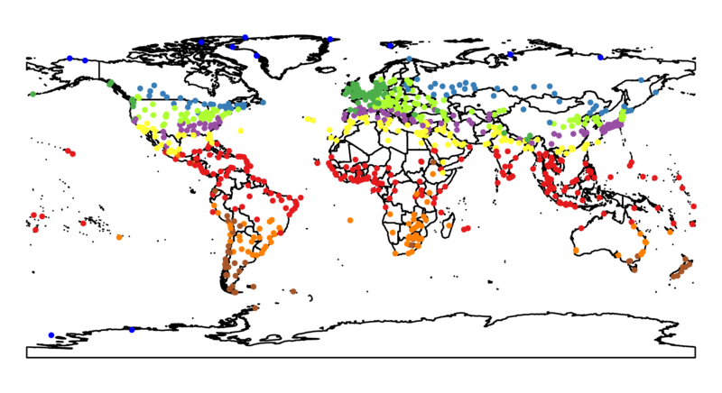

# `wikiweather` Dataset

Monthly climate data for 867 cities all around the World web-scraped by
Anna Cena and Marek Gagolewski from the English
[Wikipedia](https://en.wikipedia.org) on January 12, 2016.

Each of the 12 CSV files consists of the following columns
(missing values are allowed):

* City,
* Average high temperature [°C],
* Average low temperature [°C],
* Daily mean temperature [°C],
* Record high temperature [°C],
* Record low temperature [°C],
* Average afternoon relative humidity (%),
* Average precipitation days,
* Average precipitation [mm],
* Average rainfall [mm],
* Average rainy days,
* Average relative humidity [%],
* Average relative humidity [%] at 15:00 LST,
* Average relative humidity [%] at 9am,
* Average relative humidity [%] at Daytime,
* Average relative humidity [%] daily average,
* Average snowfall [cm],
* Mean daily sunshine hours,
* Mean monthly sunshine hours,
* Percent possible sunshine,
* Record low wind chill

The data sets require a bit of data cleansing.

* [January.csv](January.csv)
* [February.csv](February.csv)
* [March.csv](March.csv)
* [April.csv](April.csv)
* [May.csv](May.csv)
* [June.csv](June.csv)
* [July.csv](July.csv)
* [August.csv](August.csv)
* [September.csv](September.csv)
* [October.csv](October.csv)
* [November.csv](November.csv)
* [December.csv](December.csv)

Example clustering based on average low and high temperatures in
January and July:

